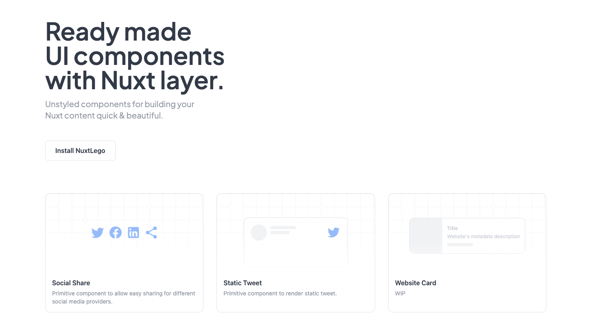

<!-- PROJECT LOGO -->
<br />
<p align="center">
  <a href="https://github.com/zernonia/nuxt-lego">
    
  </a>
  <p align="center">
  <a href='https://github.com/zernonia/nuxt-lego/actions/workflows/test.yml'>
  </a>
  <a href="https://www.npmjs.com/package/nuxt-lego" target="__blank"></a>
  <a href="https://www.npmjs.com/package/nuxt-lego" target="__blank"></a>
  <a href="https://github.com/zernonia/nuxt-lego" target="__blank"></a>
  </p>

  <h1 align="center"><strong>NuxtLego</strong></h1>

  <p align="center"> 
    Unstyled components for building your
Nuxt content quick & beautiful.
    <br />
    <br />
    <a href="https://nuxt-lego.vercel.app/">View Demo</a>
    ·
    <a href="https://github.com/zernonia/nuxt-lego/issues">Report Bug</a>
    ·
    <a href="https://github.com/zernonia/nuxt-lego/issues">Request Feature</a>
  </p>
</p>



# 📇 About The Project

This idea was inspired by [Radix Primitive](https://www.radix-ui.com/), as well as [Oku UI](https://github.com/oku-ui). I wanted to try and create a _non-generic_ component, but using Radix's primitive approach. One example of non-generic component is [Static Tweet](https://nuxt-lego.vercel.app/docs/components/static-tweet).

This project also serve as a playground for me to learn and utilize more of Vue's `provide/inject` API.

Do let me know what component you have in mind that you are longing for ya!

# Getting started

## Install

```bash
npm install --save-dev nuxt-lego

# Using yarn
yarn add --dev nuxt-lego
```

Requires Nuxt >= 3.1.0.

## Register Layer

_nuxt.config.ts_

```ts
export default defineNuxtConfig({
  extends: ["nuxt-lego"],
});
```

# 🔥 Contributors

<a href="https://github.com/zernonia/nuxt-lego/graphs/contributors">
  
</a>
 
# 🌎 Local Development

## Setup

Make sure to install the dependencies:

```bash
# pnpm
pnpm install
```

## Development Server

Start the development server on http://localhost:3000

```bash
pnpm run dev
```

# ➕ Contributing

Any contributions you make are **greatly appreciated**.

1. Fork the Project
2. Create your Feature Branch (`git checkout -b feature/AmazingFeature`)
3. Commit your Changes (`git commit -m 'Add some AmazingFeature'`)
4. Push to the Branch (`git push origin feature/AmazingFeature`)
5. Open a Pull Request

# 📜 License

Not Associated with Supabase.

Distributed under the MIT License. See `LICENSE` for more information.

# 📧 Contact

Zernonia - [@zernonia](https://twitter.com/zernonia)

# ☕ Support

If you like my work, please buy me a coffee 😳

[](https://www.buymeacoffee.com/zernonia)
